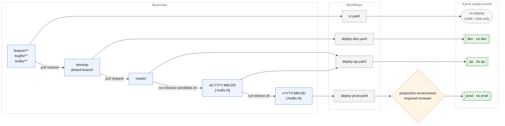

# FIPC-style Branching on kyma-master (BTP Kyma) — APPLIED


**Status: ✅ applied** to `kyma-master/`. All workflow and chart YAML parses, all shell
scripts pass `bash -n`, `helm lint` passes for all three environments, `helm template`
renders dev output equivalent to the original `k8s/` manifests, and `npm test` passes
(3/3).


---

## How the branches flow



Every solid arrow into a workflow is an automatic trigger on push. The only place a human
stands in the way is the `production` environment gate — the one deliberate departure
from FIPC's branch matrix. Release branches merge back into `master` and `develop` once
they ship.

## What the deploy pipeline does

`wf-deploy-kyma.yaml` is called by all three deploy workflows. It splits into two jobs so
the approval gate sits *after* the image exists but *before* anything touches a cluster:

```mermaid
flowchart LR
    subgraph build["job: build &mdash; always runs"]
        B1["checkout +<br/>check-env-placeholders.sh"]
        B2["npm test"]
        B3["resolve image repo + host<br/>from values-ENV.yaml"]
        B4["docker build &amp; push<br/>branch-run-sha7<br/>+ branch-latest"]
        B1 --> B2 --> B3 --> B4
    end

    GATE{"GitHub environment<br/>reviewer approval<br/><i>prod only</i>"}

    subgraph deploy["job: deploy &mdash; bound to the environment"]
        D1["setup-kyma-tools.sh<br/>+ verify Kyma CRDs"]
        D2["helm lint + template,<br/>record current revision"]
        D3["helm upgrade --install<br/>--atomic --wait"]
        D4["wait-apirule-<br/>ready.sh"]
        D5["smoke-test.sh<br/>GET /healthz, GET /"]
        D1 --> D2 --> D3 --> D4 --> D5
    end

    OK(["job summary<br/>branch, ns, image, URL"])
    RB["helm rollback to<br/>recorded revision<br/><i>dev / qa only</i>"]

    B4 --> GATE --> D1
    D5 --> OK
    D3 -. "failure" .-> RB
    D4 -. "failure" .-> RB
    D5 -. "failure" .-> RB

    classDef step fill:#eef4ff,stroke:#4472c4,color:#1a1a1a
    classDef gate fill:#fff4e5,stroke:#e08600,color:#1a1a1a
    classDef fail fill:#fdecea,stroke:#d32f2f,color:#1a1a1a
    classDef done fill:#e8f5e9,stroke:#43a047,color:#1a1a1a
    class B1,B2,B3,B4,D1,D2,D3,D4,D5 step
    class GATE gate
    class RB fail
    class OK done
    style build fill:#ffffff,stroke:#cccccc,color:#666666
    style deploy fill:#ffffff,stroke:#cccccc,color:#666666
```



The placeholder guard runs first, in the **build** job, so an unprovisioned environment
fails cheaply rather than after a registry write.

## Branch → environment matrix (as implemented)

| Branch | DEPLOY_ENV | Namespace | Kubeconfig secret | Workflow | Deploy? |
|---|---|---|---|---|---|
| any PR, `feature/**`, `bugfix/**`, `hotfix/**` | none | — | — | `ci.yaml` | ❌ build + test only |
| `develop` | dev | `dev` | `KYMA_KUBECONFIG_DEV` | `deploy-dev.yaml` | ✅ auto |
| `master` | qa | `qa` | `KYMA_KUBECONFIG_QA` | `deploy-qa.yaml` | ⏸ auto once QA shoot filled in |
| `rel.YYYY.MM.DD[-hotfix.N]` | qa (RC) | `qa` | `KYMA_KUBECONFIG_QA` | `deploy-qa.yaml` | ⏸ same |
| `vYYYY.MM.DD[-hotfix.N]` | prod | `prod` | `KYMA_KUBECONFIG_PROD` | `deploy-prod.yaml` | 🔒 auto **after approval**, once PROD shoot filled in |

Mapping back to FIPC's `Jenkinsfile` `switch (BRANCH_NAME)`:

| FIPC | Here |
|---|---|
| `case ~/(^PR-.*)/ → 'none'` | `ci.yaml` on `pull_request` — no deploy job exists |
| `case ~/(develop)/ → 'dev'` | `deploy-dev.yaml`, `on.push.branches: [develop]` |
| `case ~/(master)/ → 'qa'` | `deploy-qa.yaml`, `master` |
| `case ~/^rel\.\d{4}\.\d{2}\.\d{2}(-hotfix\.\d+)?/ → 'qa'` | `deploy-qa.yaml`, glob `rel.[0-9][0-9][0-9][0-9].[0-9][0-9].[0-9][0-9]` (+ `-hotfix.[0-9]*`) |
| `case ~/^v\d{4}\.\d{2}\.\d{2}(-hotfix\.\d+)?/ → 'prod'` | `deploy-prod.yaml`, same glob with `v` prefix |
| `kubectl config use-context gardener-us / gardener-usprod` | per-env `KYMA_KUBECONFIG_*` secret |
| `fipc-dev` / `fipc-qa` / `fipc-prod` image names | `demoappdeploytokyma-dev` / `-qa` / `-prod` |
| `${IMAGE_NAME}:${BRANCH_NAME}-${BUILD_NUMBER}` | `<branch>-<run_number>-<short-sha>`, slashes → `-` |
| `checkHealth()` post-deploy | `scripts/smoke-test.sh` |
| `Rollback` stage, dev/qa only | `helm rollback` step, `auto_rollback: true` on dev/qa only |

FIPC's one shared `Jenkinsfile` maps to one reusable workflow,
`wf-deploy-kyma.yaml`, called by three thin per-environment callers. The `switch`
moves from Groovy into the callers' branch filters.

---

## Files

### Added (16)

| File | Purpose |
|---|---|
| `.github/workflows/wf-deploy-kyma.yaml` | Reusable pipeline: test → build/push → guard → helm lint/template → `helm upgrade --install --atomic` → APIRule wait → smoke test → rollback-on-failure → job summary |
| `.github/workflows/ci.yaml` | PRs + topic branches: tests, `bash -n`, helm lint/template for all 3 envs, image build without push |
| `.github/workflows/deploy-dev.yaml` | `develop` → dev |
| `.github/workflows/deploy-qa.yaml` | `master` + `rel.*` → qa |
| `.github/workflows/deploy-prod.yaml` | `v*` → prod, bound to `production` environment |
| `.github/CODEOWNERS` | Service owner as required reviewer (placeholder handle) |
| `.github/pull_request_template.md` | Target-branch + checks checklist |
| `helm/demoapp/Chart.yaml` | Chart metadata |
| `helm/demoapp/values.yaml` | Shared defaults; `image.tag` deliberately empty |
| `helm/demoapp/values-dev.yaml` | dev — real shoot `c-1282d6a.stage` |
| `helm/demoapp/values-qa.yaml` | qa — `<QA_SHOOT>` placeholder + TODO |
| `helm/demoapp/values-prod.yaml` | prod — `<PROD_SHOOT>` placeholder, 2 replicas, larger limits |
| `helm/demoapp/templates/_helpers.tpl` | Names, labels, and a `required` guard on `image.tag` |
| `helm/demoapp/templates/{deployment,service,apirule}.yaml` | Ported from `k8s/`, APIRule handles both `v2` and `v1beta1` via `.Capabilities` |
| `scripts/setup-kyma-tools.sh` | Decode kubeconfig, install kubectl/helm/yq (adapted from hello-world-service) |
| `scripts/check-env-placeholders.sh` | Fails the build if a values file still has `<QA_SHOOT>`-style placeholders |
| `scripts/wait-apirule-ready.sh` | APIRule readiness poll |
| `scripts/smoke-test.sh` | Post-deploy `GET /healthz` + `GET /` against the public host |
| `scripts/cut-release-candidate.sh` | Cuts `rel.YYYY.MM.DD[-hotfix.N]` from master |
| `scripts/cut-release.sh` | Promotes `rel.*` → `v*`, validating the RC exists |
| `scripts/apply-branch-protection.sh` | Protection on `develop` / `master` via `gh` |
| `CONTRIBUTING.md` | The branching contract, modelled on FIPC's |
| `docs/branch-protection.md` | `main` → `develop`/`master` migration, protection, `production` environment, secret scoping, runners |

### Modified (1)
- `README.md` — branch matrix, per-env URLs, release commands, the three kubeconfig
  secrets, pointer to the setup doc.

### Superseded but **not deleted**
- `k8s/{deployment,service,apirule}.yaml` — fully replaced by `helm/demoapp`. I was
  blocked from deleting the directory, so **delete it by hand**:
  ```bash
  rm -rf kyma-master/k8s
  ```
  A copy is in `.branching-backup/k8s/` either way. Leaving both in place is only
  confusing, not harmful — nothing references `k8s/` any more.

### Note on the original workflow
The README described a `.github/workflows/deploy.yml`, but no `.github/` directory came
down with the download, so there was nothing to preserve or diff against. The workflows
here are written fresh. **If that `deploy.yml` exists on the remote, compare it against
`wf-deploy-kyma.yaml` before pushing** — in particular the registry name, the image
repository, and the namespace, which I took from `k8s/` and the README.

---

## Deliberate differences from FIPC

1. **Prod has an approval gate.** FIPC deploys `v*` unattended. Here the deploy job
   binds to the `production` GitHub environment. Same decision you took for the CF repo.
2. **Real rollback.** FIPC's `Rollback` stage is commented out and `error()`s with
   "Rollback currently unavailable". Helm gives this for free: `--atomic` reverts a
   failed rollout, and an explicit `helm rollback` covers a failed APIRule wait or smoke
   test on dev/qa.
3. **Immutable tag includes the SHA.** FIPC's `<branch>-<build>` can collide after a
   Jenkins job reset; `<branch>-<run>-<sha7>` cannot.
4. **`KYMA_KUBECONFIG_PROD` is scoped to the `production` environment**, not the
   repository, so no non-prod workflow can read prod credentials.

## Required follow-ups (cannot be done from files alone)

1. **`.github/CODEOWNERS`** — replace `@OWNER-TEAM-PLACEHOLDER` with the real handle.
2. **Provision the QA and PROD Kyma subaccounts**, then replace `<QA_SHOOT>` /
   `<PROD_SHOOT>` in `helm/demoapp/values-qa.yaml` and `values-prod.yaml` and add the
   `KYMA_KUBECONFIG_QA` / `KYMA_KUBECONFIG_PROD` secrets. Until then `master` / `rel.*` /
   `v*` build and test, then fail at the placeholder guard **by design**.
3. **Branch migration on the remote** — create `develop` + `master`, make `develop`
   default, re-target open PRs, retire `main`. Commands in `docs/branch-protection.md`.
4. **Create the `production` environment** with required reviewers and branch pattern
   `v*`. Without it the prod job runs unattended and the gate is a no-op.
5. **Apply branch protection** — `./scripts/apply-branch-protection.sh <owner>/<repo>`,
   confirming the CI status-check job name first.
6. **Per-namespace prerequisites in each cluster** — the `hello-world-registry`
   imagePullSecret and the `dev`/`qa`/`prod` namespaces with Istio injection enabled.
   `hello-world-service` has a `verify-kyma-bootstrap-contract.sh` for exactly this; no
   equivalent bootstrap contract exists for this repo yet.
7. **Delete `k8s/`** (see above).

## Out of scope (noted for follow-up)
- **BlackDuck / FOSS scan** on dev and qa. FIPC calls `BlackDuckScan(...)` from the
  `gtlc-pipe-libs` Jenkins shared library; there is no Actions equivalent wired here.
- **e2e tests** from the separate `GTLCDEV-FossCompliance/e2e-test` repo. The smoke test
  covers the two endpoints this service actually has.
- Provisioning the QA/PROD subaccounts themselves.

## Rollback of this change
```bash
cd kyma-master
cp -R .branching-backup/k8s ./k8s        # if you already deleted it
rm -rf .github helm scripts docs/branch-protection.md CONTRIBUTING.md
git checkout README.md                   # once the repo is under git
```
